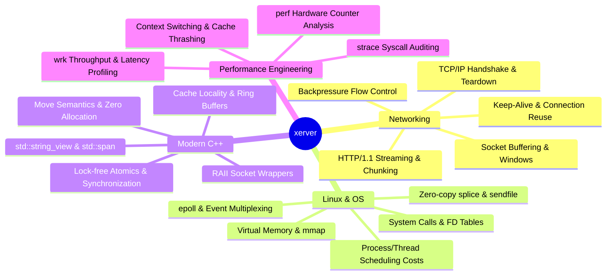

# xerver: High-Performance Linux Reverse Proxy

`xerver` is an educational, production-grade systems software project written from scratch in **C++20/C++23** on **Linux**.

Rather than relying on modern asynchronous abstractions (such as Boost.Asio, Tokio, libuv, or Nginx), `xerver` is built step-by-step from raw Linux system calls (`socket`, `bind`, `epoll`, `fcntl`, `splice`). The explicit goal is to demystify how the Linux kernel, network stack, and modern systems programming languages collaborate to serve hundreds of thousands of concurrent connections with microsecond-level latency.

---

## Core Philosophy

> **Do not hide behind abstractions until you understand what they are abstracting.**

High-level libraries and frameworks handle connection pooling, non-blocking I/O multiplexing, and backpressure automatically. By implementing these primitives by hand:
1. You learn the cost of kernel-to-user-space transitions.
2. You experience the C10K problem firsthand and discover why thread-per-connection falls over.
3. You implement backpressure and understand how unbounded buffering causes OOM crashes.
4. You benchmark and profile with hardware performance counters, observing cache misses and context switches.

Once completed in C++, components can optionally be rewritten in **Rust** to compare memory safety paradigms, zero-cost abstractions, and systems concurrency models.

---

## Documentation Navigation

- [**Roadmap & Milestones**](file:///Users/drumilbhati/Documents/Github/xerver/docs/roadmap.md): Detailed 10-stage progression from a single-client TCP echo server to a fully tuned reverse proxy.
- [**System Architecture**](file:///Users/drumilbhati/Documents/Github/xerver/docs/architecture.md): Event-driven Reactor pattern, dual-socket bridging, connection state machines, and backpressure mechanics.
- [**Tooling & Environment**](file:///Users/drumilbhati/Documents/Github/xerver/docs/tooling-and-environment.md): Setting up the Linux VM on macOS, using `epoll`, `strace`, `gdb`, `perf`, `tcpdump`, `ss`, and `wrk`.

---

## What You Learn

---

## Technology Stack

| Domain | Technology |
| :--- | :--- |
| **Language** | C++20 / C++23 (Concepts, RAII, `std::span`, `std::string_view`, atomics) |
| **Operating System** | Linux (Ubuntu 24.04 LTS / Kernel 6.x) |
| **Build System** | CMake 3.28+, Ninja |
| **I/O Multiplexing** | Linux `epoll` (`epoll_create1`, `epoll_ctl`, `epoll_wait`) |
| **Debugging & Diagnostics** | `gdb`, `strace`, `valgrind`, AddressSanitizer (ASan), UBSan |
| **Profiling & Metrics** | `perf`, `flamegraph`, `ss`, `tcpdump` |
| **Benchmarking** | `wrk`, `hey`, `netcat` |
