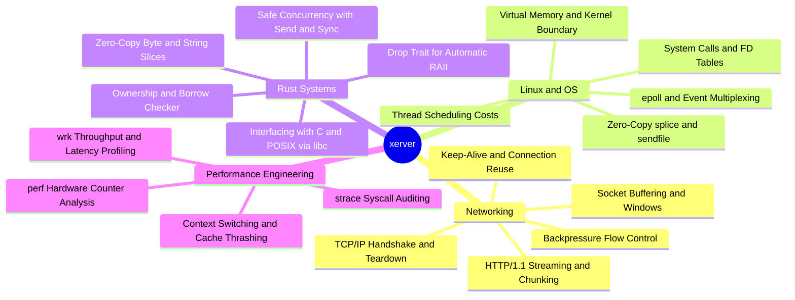

# xerver: High-Performance Linux Reverse Proxy in Rust

`xerver` is a systems software project built from scratch in **Rust** on **Linux**, evolving from a basic TCP echo server into a production-grade reverse proxy.

Rather than hiding behind modern asynchronous runtimes (such as Tokio, Actix, Hyper, or Pingora), `xerver` starts with raw networking primitives (`std::net`, `libc::epoll`, non-blocking I/O, `splice`). The explicit goal is to understand how the Linux kernel, network stack, and systems programming languages collaborate to serve hundreds of thousands of concurrent connections with microsecond-level latency.

---

## Core Philosophy

> **Do not hide behind abstractions until you understand what they are abstracting.**

Frameworks like Tokio and Hyper handle asynchronous event loops, connection pooling, and backpressure automatically. By implementing these primitives by hand:
1. You learn how the OS kernel schedules and notifies I/O readiness via `epoll`.
2. You experience the C10K problem firsthand and discover why thread-per-connection falls over.
3. You implement backpressure and understand how unbounded buffering causes Out-Of-Memory (OOM) crashes.
4. You discover why Rust's ownership model, `Drop` trait, and type-system guarantees make high-performance networking both blisteringly fast and memory-safe.

---

## Documentation Navigation

- [**Roadmap & Milestones**](file:///Users/drumilbhati/Documents/Github/xerver/docs/roadmap.md): Detailed 10-stage progression from a single-client TCP echo server to a fully tuned reverse proxy.
- [**System Architecture**](file:///Users/drumilbhati/Documents/Github/xerver/docs/architecture.md): Event-driven Reactor pattern, dual-socket bridging, connection state machines, and backpressure mechanics.
- [**Tooling & Environment**](file:///Users/drumilbhati/Documents/Github/xerver/docs/tooling-and-environment.md): Setting up the Linux environment, Cargo workflows, and profiling with `epoll`, `strace`, `perf`, `ss`, and `wrk`.

---

## What You Learn

---

## Technology Stack

| Domain | Technology |
| :--- | :--- |
| **Language** | Rust 2021/2024 Edition (Zero-cost abstractions, pattern matching, ownership) |
| **Operating System** | Linux (Debian Bookworm / Kernel 6.x) |
| **Build & Package System** | Cargo (`cargo build`, `cargo test`, `cargo clippy`) |
| **I/O Multiplexing** | Linux `epoll` (`libc::epoll_create1`, `libc::epoll_ctl`, `libc::epoll_wait`) |
| **Debugging & Diagnostics** | `gdb`, `lldb`, `strace`, `valgrind` |
| **Profiling & Metrics** | `perf`, `flamegraph`, `ss`, `tcpdump` |
| **Benchmarking** | `wrk`, `hey`, `netcat` |
