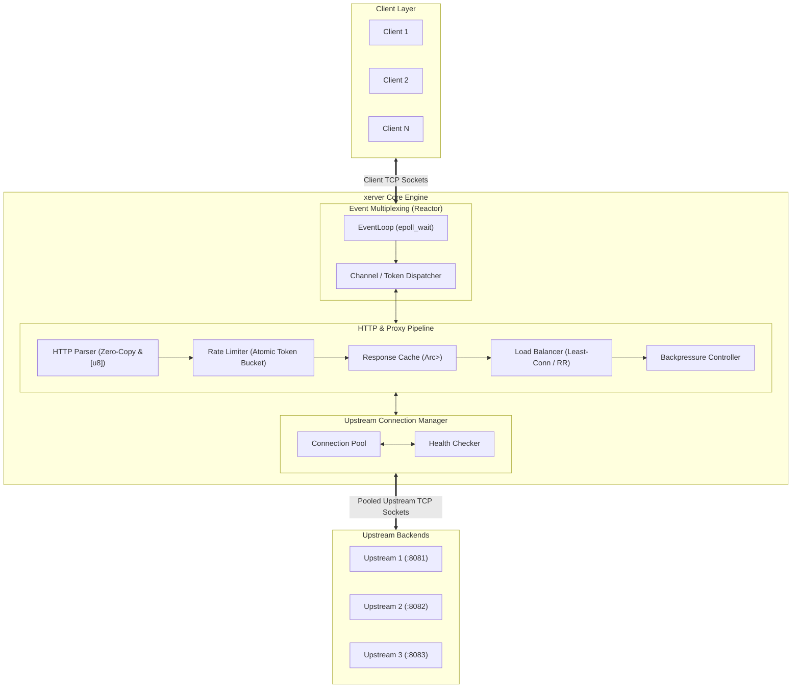
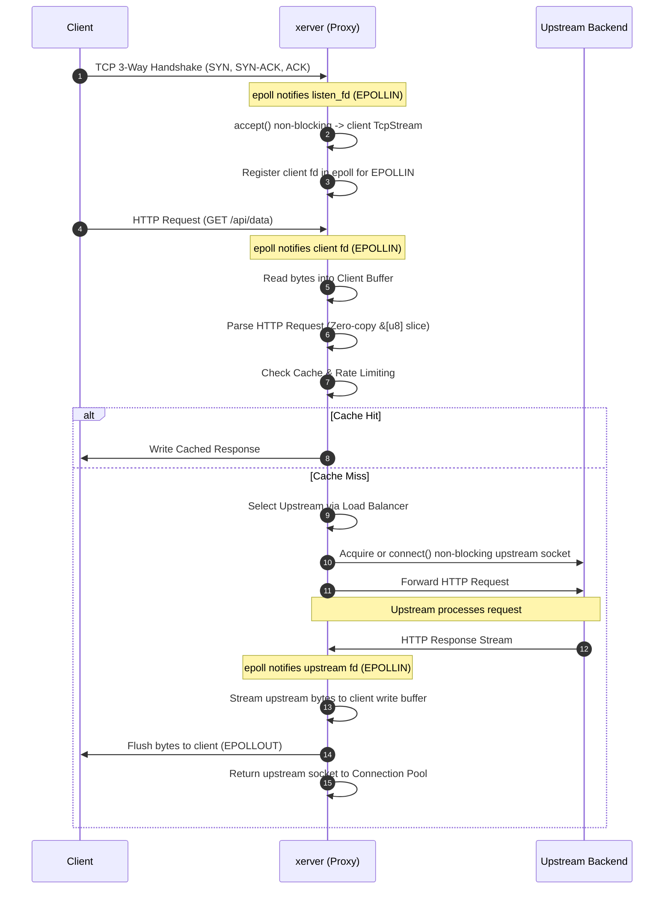
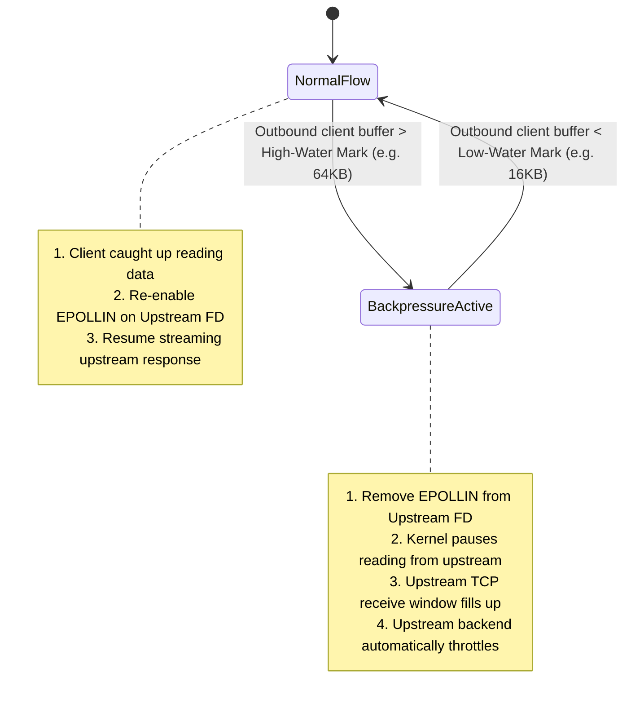

# System Architecture (Rust)

This document describes the architectural design of `xerver` in Rust, including the event-driven Reactor pattern, connection lifecycle, buffer management, and backpressure mechanisms.

---

## 1. High-Level System Topology

---

## 2. Event-Driven Reactor Pattern

`xerver` uses an asynchronous, non-blocking **Reactor Pattern**:
- A single thread monitors thousands of file descriptors via `libc::epoll_wait`.
- When an I/O event occurs, the kernel wakes `epoll_wait`, returning an array of triggered `libc::epoll_event` structs.
- The event loop dispatches each event to its corresponding socket token (`handle_read()`, `handle_write()`, `handle_close()`).

### Scaled Model: Thread-Per-Core (Shared-Nothing)
To scale across multiple CPU cores without lock contention, `xerver` can be deployed in a **Thread-Per-Core** architecture:
- Each worker thread runs its own isolated `EventLoop` and `epoll` instance.
- Kernel load-balances incoming connections using the Linux socket flag `SO_REUSEPORT`.
- Rust's type system statically verifies thread boundaries via the `Send` and `Sync` traits.

---

## 3. Transaction Lifecycle (Dual-Socket Bridge)

A reverse proxy request coordinates two separate TCP connections: **Downstream (Client)** and **Upstream (Backend)**.

---

## 4. Backpressure & Flow Control

Handling **speed mismatches**:
- **Fast Upstream** (1 Gbps local LAN backend)
- **Slow Client** (50 KBps mobile network)

If the proxy blindly reads from the upstream as fast as possible without checking if the client can accept data, user-space memory will grow indefinitely, exhausting system RAM and triggering the Linux **OOM Killer**.

### The Solution: High/Low Watermarks

---

## 5. Memory Management & Zero-Copy in Rust

### Zero-Allocation Hot Path
1. **Borrowing & Slices**: HTTP parsing borrows slices of the raw byte buffer (`&[u8]`, `&str`) without allocating dynamic `String` instances on the heap.
2. **Buffer Pools**: Pre-allocated byte vectors (`Vec<u8>`) are recycled using an object pool to avoid memory allocator thrashing.
3. **Linux `splice(2)` Zero-Copy Relay**:
   Piping data directly between two socket buffers inside the Linux kernel:
   $$\text{Upstream Socket Buffer} \xrightarrow{\text{splice}} \text{Pipe Buffer} \xrightarrow{\text{splice}} \text{Client Socket Buffer}$$
