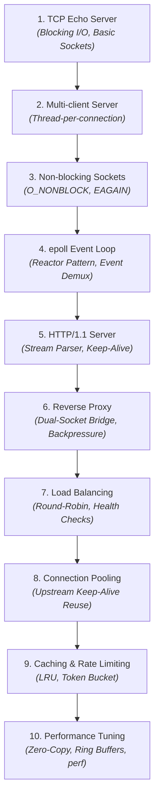
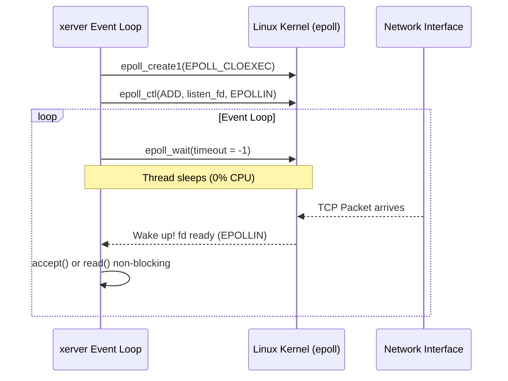
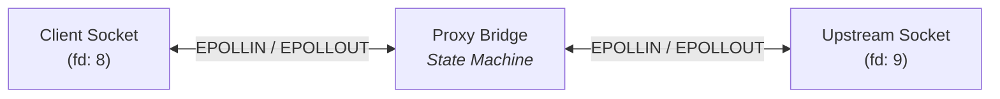

# Development Roadmap: From Echo Server to Reverse Proxy

This roadmap details the 10-phase incremental evolution of `xerver`. Each stage directly addresses a fundamental scaling bottleneck encountered in the previous one.



---

## Milestone 1: TCP Echo Server

### Objective
Create a single-client TCP echo server that listens on a port, accepts an incoming connection, reads incoming bytes, echoes them back, and closes the connection.

### Linux / OS Concepts
- **Berkeley Sockets API**: `socket(AF_INET, SOCK_STREAM, 0)`, `bind()`, `listen()`, `accept()`, `read()`, `write()`, `close()`.
- **File Descriptors**: Everything in Linux is a file descriptor (`fd`). FDs index into the per-process file descriptor table.
- **TCP Three-Way Handshake**: Kernel manages `SYN`, `SYN-ACK`, `ACK` before `accept()` returns the connected socket fd.

### C++ Focus
- **RAII Resource Management**: Encapsulate file descriptors in a `UniqueFd` class to eliminate resource leaks:
  ```cpp
  class UniqueFd {
      int fd_ = -1;
  public:
      explicit UniqueFd(int fd) noexcept : fd_(fd) {}
      ~UniqueFd() { if (fd_ >= 0) ::close(fd_); }
      UniqueFd(UniqueFd&& o) noexcept : fd_(std::exchange(o.fd_, -1)) {}
      UniqueFd& operator=(UniqueFd&& o) noexcept {
          if (this != &o) { reset(std::exchange(o.fd_, -1)); }
          return *this;
      }
      // Non-copyable
      UniqueFd(const UniqueFd&) = delete;
      UniqueFd& operator=(const UniqueFd&) = delete;
  };
  ```

### Verification & Diagnostics
- Test with netcat: `nc localhost 8080`
- Trace system calls:
  ```sh
  strace -e trace=network,read,write ./build/xerver
  ```

### The Limitation
The server blocks on `read()`. If client A connects and sits idle, no other client can connect.

---

## Milestone 2: Multi-client Server (Thread-per-Connection)

### Objective
Allow multiple clients to connect simultaneously by spawning a worker thread per client (or using a fixed thread pool).

### Linux / OS Concepts
- **`pthread_create` / `std::thread`**: Spawning OS threads managed by the Linux scheduler (`CFS` / `EEVDF`).
- **Thread Stack Memory**: Each Linux thread allocates a default virtual stack (typically 2MB to 8MB via `ulimit -s`).
- **Context Switching**: CPU registers must be saved and restored when switching threads; cache lines get evicted.
- **The C10K Problem**: Connecting 10,000 clients requires 10,000 threads, which consumes ~80GB of virtual stack memory and cripples the CPU scheduler.

### Verification & Diagnostics
- Launch 50 concurrent netcat connections and observe thread counts:
  ```sh
  ps -T -p $(pgrep xerver)
  ```

### The Limitation
Thread-per-connection does not scale past a few thousand connections due to memory footprint and context-switching overhead.

---

## Milestone 3: Non-blocking Sockets

### Objective
Switch sockets into non-blocking mode so system calls return immediately instead of putting the thread to sleep.

### Linux / OS Concepts
- **`fcntl(fd, F_SETFL, O_NONBLOCK)`**: Modifies socket state flags in the kernel.
- **`EAGAIN` / `EWOULDBLOCK`**: Kernel informs user space: *"There is no data currently available; try again later."*
- **Busy-Polling Anti-pattern**: Calling `read()` in a `while(true)` loop burns 100% CPU on idle connections.

### C++ Focus
- Distinguishing fatal network errors (`ECONNRESET`, `EPIPE`) from transient non-blocking conditions (`EAGAIN`, `EWOULDBLOCK`, `EINTR`).

### The Limitation
Non-blocking sockets alone require polling. We need an OS mechanism that **sleeps until at least one socket is ready**, then wakes us up.

---

## Milestone 4: epoll-based Event Loop (Reactor Pattern)

### Objective
Build a single-threaded (or thread-per-core) event loop using the Linux `epoll` subsystem.



### Linux / OS Concepts
- **`epoll_create1`**, **`epoll_ctl`**, **`epoll_wait`**: Linux's $O(1)$ event demultiplexer (superior to $O(N)$ `select` and `poll`).
- **Level-Triggered vs. Edge-Triggered (`EPOLLET`)**:
  - *Level-Triggered*: `epoll_wait` keeps firing as long as the kernel buffer has unread bytes.
  - *Edge-Triggered*: `epoll_wait` fires *only once* when new data transitions from unavailable to available. Requires draining the socket until `EAGAIN`.
- **`EPOLLIN` / `EPOLLOUT` / `EPOLLRDHUP` / `EPOLLERR`**.

### C++ Focus
- **Reactor Architecture**: Encapsulating the event loop, channel dispatchers, and handler callbacks.

### Verification & Diagnostics
- Verify non-blocking event handling under load using `wrk`:
  ```sh
  wrk -t4 -c1000 -d10s http://localhost:8080/
  ```

---

## Milestone 5: HTTP/1.1 Server

### Objective
Implement an HTTP/1.1 protocol parser that processes incoming byte streams, handles Keep-Alive connections, and returns HTTP responses.

### Linux / OS Concepts
- **TCP Stream Semantics**: TCP has no concept of "messages" or "packets" in user space; it is an arbitrary stream of bytes. An HTTP request may arrive fragmented across multiple `read()` calls, or multiple requests may arrive coalesced in one `read()`.
- **TCP Buffering**: `SO_RCVBUF` and `SO_SNDBUF`.

### C++ Focus
- **Zero-Copy Parsing**: Using `std::string_view` to parse request lines and headers directly against the buffer without intermediate string allocations.
- **State Machine Parsing**:
  - Parse Request Line (`METHOD /path HTTP/1.1`)
  - Parse Headers (`Host`, `Content-Length`, `Connection`)
  - Read Body (accounting for `Content-Length` or `Transfer-Encoding: chunked`)
- **Connection Keep-Alive**: Reusing the same socket across multiple HTTP requests until the client closes it or an idle timeout triggers.

---

## Milestone 6: Reverse Proxy Core (Dual-Socket Bridge)

### Objective
Transform the server into a reverse proxy. When a client connects, the proxy opens a socket to an upstream backend server and relays bytes between both endpoints.



### Linux / OS Concepts
- **Non-blocking `connect()`**: `connect()` returns `EINPROGRESS`. The proxy monitors the socket for `EPOLLOUT` to know when the TCP handshake with the upstream completes.
- **Backpressure**:
  - What if the upstream sends data at 100 MB/s, but the client reads at 100 KB/s?
  - Unbounded memory buffering causes an Out-Of-Memory (OOM) crash.
  - **Solution**: When the client outbound buffer exceeds a high-water mark, remove `EPOLLIN` from the upstream socket. When the client outbound buffer drains below a low-water mark, re-enable `EPOLLIN` on the upstream.

---

## Milestone 7: Load Balancing & Health Checks

### Objective
Distribute incoming requests across a cluster of upstream backend instances.

### Key Algorithms & Features
- **Balancing Strategies**:
  - Round-Robin
  - Weighted Round-Robin
  - Least-Connections (routes to upstream with lowest active requests)
  - IP Hash / Consistent Hashing
- **Health Checking**:
  - *Active Health Checking*: Periodic background probe (e.g. `GET /health` every 5 seconds).
  - *Passive Health Checking*: Mark upstream down if consecutive requests fail with `ECONNREFUSED` or timeout.

---

## Milestone 8: Upstream Connection Pooling

### Objective
Maintain a pool of persistent, established TCP connections to upstream backends to eliminate connection setup latency.

### Linux / OS Concepts & Gains
- **Eliminating TCP Handshakes**: Eliminates 1 RTT of latency per backend request.
- **Preventing `TIME_WAIT` Exhaustion**: Closing connections rapidly exhausts ephemeral ports (`net.ipv4.ip_local_port_range`). Reusing connections prevents port exhaustion.
- **Socket Recycling**: After an HTTP transaction completes, the upstream socket returns to an idle pool rather than calling `close()`.

---

## Milestone 9: Caching & Rate Limiting

### Objective
Add an in-memory HTTP cache for idempotent GET requests and a token-bucket rate limiter to protect backends from abusive traffic.

### Implementation Details
- **In-Memory Cache**:
  - Key: `Hash(Method + URI + Host)`
  - Eviction: Thread-safe LRU (Least Recently Used) cache with TTL (Time To Live).
  - Honors `Cache-Control` headers (`no-cache`, `max-age`).
- **Rate Limiting**:
  - Token Bucket / Leaky Bucket algorithm per client IP.
  - Fast, lock-free or partitioned bucket counters using `std::atomic`.
  - Returns `429 Too Many Requests` on breach.

---

## Milestone 10: Performance Optimization & Profiling

### Objective
Benchmark the reverse proxy against industrial baselines (e.g., Nginx, Envoy) and optimize CPU, memory, and kernel interactions.

### Techniques
1. **Zero-Copy I/O**:
   - `splice(2)`: Pipe data directly between two socket buffers in the Linux kernel without copying data to user space.
   - `sendfile(2)`: Serve static cached disk files directly to sockets.
2. **Buffer Management**:
   - Buffer pools / slab allocators to eliminate dynamic memory allocations (`malloc`/`new`) in the hot loop.
3. **Profiling**:
   - `perf top` & `perf record` to find cache misses (`L1-dcache-load-misses`) and branch mispredictions.
   - Generate FlameGraphs to visualize CPU consumption.
   - System call auditing with `strace -c`.
