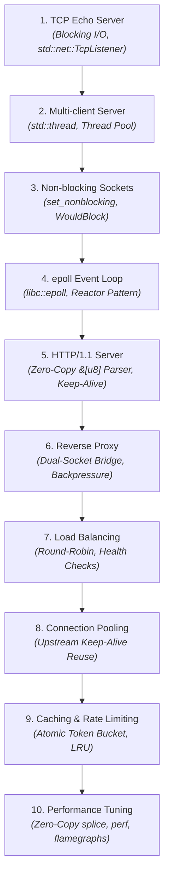
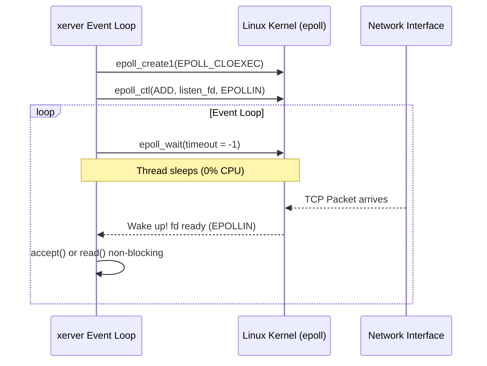
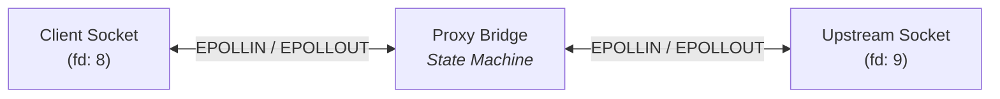

# Development Roadmap: From Echo Server to Reverse Proxy (Rust)

This roadmap details the 10-phase incremental evolution of `xerver` in Rust. Each stage directly addresses a fundamental scaling bottleneck encountered in the previous one.



---

## Milestone 1: TCP Echo Server

### Objective
Create a single-client TCP echo server that listens on a port, accepts an incoming connection, reads incoming bytes, echoes them back, and closes the connection.

### Linux & Networking Concepts
- **Berkeley Sockets API**: `socket()`, `bind()`, `listen()`, `accept()`, `read()`, `write()`, `close()`.
- **File Descriptors**: Everything in Linux is a file descriptor (`fd`).
- **TCP Three-Way Handshake**: Kernel manages `SYN`, `SYN-ACK`, `ACK` before `accept()` returns the connected socket fd.

### Rust Focus
- **Built-in RAII (`Drop`)**: Sockets in Rust (`std::net::TcpStream`) automatically close their file descriptor when dropped at the end of scope.
- **Error Handling**: Using `Result<T, std::io::Error>` and the `?` operator for clean, idiomatic error handling.
- **Reading & Writing**: Implementing `std::io::Read` and `std::io::Write`.

### Verification & Diagnostics
- Test with netcat: `nc localhost 8080`
- Trace system calls:
  ```sh
  strace -e trace=network,read,write ./target/debug/xerver
  ```

### The Limitation
The server blocks on `read()`. If client A connects and sits idle, no other client can connect.

---

## Milestone 2: Multi-client Server (Thread-per-Connection)

### Objective
Allow multiple clients to connect simultaneously by spawning a worker thread per client (and transitioning to a fixed-size thread pool).

### Linux & OS Concepts
- **Thread Stack Memory**: Each OS thread allocates a virtual stack (typically 2MB to 8MB via `ulimit -s`).
- **Context Switching**: CPU registers must be saved and restored when switching threads; cache lines get evicted.
- **The C10K Problem**: Connecting 10,000 clients requires 10,000 threads, which consumes ~80GB of virtual stack memory and cripples the CPU scheduler.

### Rust Focus
- Spawning OS threads using `std::thread::spawn`.
- Move closures: transferring ownership of `TcpStream` into the thread closure (`move || { ... }`).
- Thread pools using crossbeam channels or standard mpsc channels for task dispatch.

---

## Milestone 3: Non-blocking Sockets

### Objective
Switch sockets into non-blocking mode so system calls return immediately instead of putting the thread to sleep.

### Linux & OS Concepts
- **`fcntl(fd, F_SETFL, O_NONBLOCK)`**: Modifies socket state flags in the kernel.
- **`EAGAIN` / `EWOULDBLOCK`**: Kernel informs user space: *"There is no data currently available; try again later."*
- **Busy-Polling Anti-pattern**: Calling `read()` in a `loop` burns 100% CPU on idle connections.

### Rust Focus
- `stream.set_nonblocking(true)`.
- Matching on `std::io::ErrorKind::WouldBlock` vs. fatal I/O errors.

### The Limitation
Non-blocking sockets alone require polling. We need an OS mechanism that **sleeps until at least one socket is ready**, then wakes us up.

---

## Milestone 4: epoll-based Event Loop (The Reactor Pattern)

### Objective
Build our own single-threaded (or thread-per-core) event loop using the Linux `epoll` subsystem via the `libc` crate—discovering what Tokio's `mio` actually does under the hood.



### Linux / OS Concepts
- **`epoll_create1`**, **`epoll_ctl`**, **`epoll_wait`**: Linux's $O(1)$ event demultiplexer.
- **Level-Triggered vs. Edge-Triggered (`EPOLLET`)**:
  - *Level-Triggered*: `epoll_wait` keeps firing as long as the kernel buffer has unread bytes.
  - *Edge-Triggered*: `epoll_wait` fires *only once* when new data transitions from unavailable to available.
- **`EPOLLIN` / `EPOLLOUT` / `EPOLLRDHUP` / `EPOLLERR`**.

### Rust Focus
- Safe wrappers around `libc::epoll_event`, `libc::epoll_ctl`, and `libc::epoll_wait`.
- Using `std::os::fd::AsRawFd` to access the underlying file descriptor integer.
- Designing an event loop and token-based dispatcher.

---

## Milestone 5: HTTP/1.1 Server

### Objective
Implement an HTTP/1.1 protocol parser that processes incoming byte streams, handles Keep-Alive connections, and returns HTTP responses.

### Linux & Networking Concepts
- **TCP Stream Semantics**: TCP has no concept of "messages" or "packets" in user space; it is an arbitrary stream of bytes. An HTTP request may arrive fragmented across multiple `read()` calls, or multiple requests may arrive coalesced in one `read()`.

### Rust Focus
- **Zero-Copy Parsing**: Using byte slices (`&[u8]`) and string slices (`&str`) to parse request lines and headers directly against the read buffer without allocating heap `String` objects.
- **State Machine Parsing**:
  - Parse Request Line (`METHOD /path HTTP/1.1`)
  - Parse Headers (`Host`, `Content-Length`, `Connection`)
  - Read Body (accounting for `Content-Length` or `Transfer-Encoding: chunked`)
- **Connection Keep-Alive**: Reusing the same socket across multiple HTTP requests until the client closes it or an idle timeout triggers.

---

## Milestone 6: Reverse Proxy Core (Dual-Socket Bridge)

### Objective
Transform the server into a reverse proxy. When a client connects, the proxy opens a socket to an upstream backend server and relays bytes between both endpoints.



### Linux & Systems Concepts
- **Non-blocking `connect()`**: `connect()` returns `EINPROGRESS`. The proxy monitors the socket for `EPOLLOUT` to know when the TCP handshake with the upstream completes.
- **Backpressure**:
  - What if the upstream sends data at 100 MB/s, but the client reads at 100 KB/s?
  - Unbounded memory buffering causes an Out-Of-Memory (OOM) crash.
  - **Solution**: High/low watermark flow control.

---

## Milestone 7: Load Balancing & Health Checks

### Objective
Distribute incoming requests across a cluster of upstream backend instances.

### Key Algorithms & Features
- **Balancing Strategies**: Round-Robin, Weighted Round-Robin, Least-Connections.
- **Health Checking**:
  - *Active Health Checking*: Periodic background probe (`GET /health` every 5 seconds).
  - *Passive Health Checking*: Mark upstream down if consecutive requests fail with `ECONNREFUSED` or timeout.

---

## Milestone 8: Upstream Connection Pooling

### Objective
Maintain a pool of persistent, established TCP connections to upstream backends to eliminate connection setup latency.

### Linux & Networking Concepts
- **Eliminating TCP Handshakes**: Eliminates 1 RTT of latency per backend request.
- **Preventing `TIME_WAIT` Exhaustion**: Closing connections rapidly exhausts ephemeral ports. Reusing connections prevents port exhaustion.

---

## Milestone 9: Caching & Rate Limiting

### Objective
Add an in-memory HTTP cache for idempotent GET requests and a token-bucket rate limiter to protect backends from abusive traffic.

### Rust Focus
- **In-Memory Cache**: Thread-safe LRU cache with TTL using `Arc<RwLock<...>>` or sharded locks.
- **Rate Limiting**: Token Bucket algorithm per client IP using atomic counters (`std::sync::atomic::AtomicU64`).

---

## Milestone 10: Performance Optimization & Profiling

### Objective
Benchmark the reverse proxy against industrial baselines (e.g. Nginx, Envoy) and optimize CPU, memory, and kernel interactions.

### Techniques
1. **Zero-Copy I/O**:
   - `splice(2)`: Pipe data directly between two socket buffers in the Linux kernel without copying data to user space.
2. **Profiling**:
   - `perf top` & `perf record` to find cache misses and CPU hotspots.
   - Generate FlameGraphs to visualize CPU consumption.
   - Benchmark throughput and latency distribution using `wrk`.
